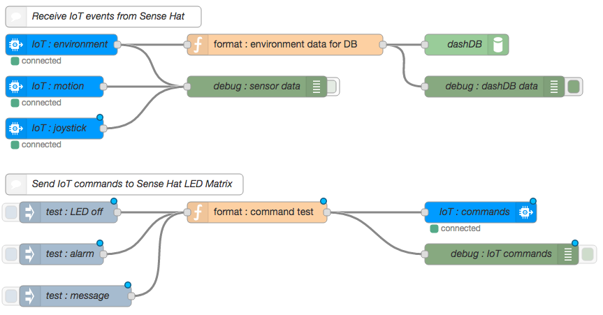
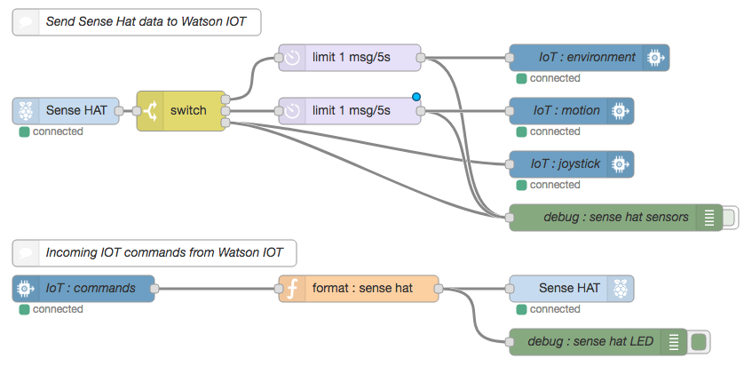

# STSA Workshop 1:  Transform Products & Services with Intelligent Connected Devices

## Architecture

This project provides a reference implementation for transforming products and services with intelligent connected devices.

## Objective
The purpose of this workshop is to get you started working with Bluemix, Node-Red, Watson IoT, and a Raspberry Pi.  You will be defining a Raspberry Pi as an IoT device in the Watson IoT service.  Following that, you will use Node-Red to create an application on the Pi that reports sensor information (temperature, humidity, barometric pressure, etc.) to another Node-Red application running on Bluemix.  Two sets of instructions are provided.  If you have prior experience and would like to try and complete the exercise on your own, follow the Jedi Master path.  Otherwise, if you prefer a more guided approach, choose the Jedi Padowan path.  Choose wisely and have fun.

### Total time to complete:  1 hour

## Prerequisites

This workshop assumes that you have completed the STSA event prerequisite activities.  Specifically, you should have:
   * An SSH terminal program for connecting to the Raspberry Pi.  If you are using a MacOS or Linux based system, you are ready to go. If using Windows, you should have installed the PuTTY application available on the IBM Standard Software installer.

## Jedi Master Path

### PART I: Start Node-Red on Raspberry Pi

-   Connect to your Raspberry Pi using SSH. Your Pi can be reached at IP
    address 192.168.32.xx. Replace the xx with your specific team
    number. For example, team 30 would use:\
    **ssh pi@192.168.32.30**
 
-   The Raspberry Pi credential are:

> User ID: pi\
> Password: raspberry

-   Start Node-Red on the Pi with the command: node-red-start.

> ***FYI**: When the Node-Red app starts, the last action it performs is
> to start a logging function. You can exit this logging, if needed, by
> pressing Ctrl-C. This will not stop Node-Red itself. If/When you want
> to stop Node-Red, you need to issue the command: node-red-stop.*

### PART II: Create the Bluemix Application Space

-   Using one of your team’s Bluemix accounts, create a new Node-Red
    application from the Node-Red boilerplate. Instructions in these
    workshops assume that the name of the application is
    **STSAWorkshops-xx** (where xx is your team number).

-   Connect the following services to your new application. The names
    for the services are in parenthesis:

    -   Internet of things (**STSAWorkshops-IoT**)

    -   Watson Conversation (**STSAWorkshops-Conversation**)

    -   dashDB for Analytics (**STSAWorkshops-dashDB**)

### Define IoT devices to Internet of Things Service

-   In your newly created Internet of things service, device a new
    device type called **PiGateway**.

-   Add a new gateway device using the newly defined PiGateway device
    type. For these workshop exercises, the device ID is assumed to be:
    **STSAGateway**.

> ***Note**: The workshops will be treating the Raspberry Pi as a
> Gateway and the attached Sense Hat as a downstream sensor device.
> However, it is not necessary to define the Sense Hat device to the IoT
> service as the gateway device will do it for you you when the Sense
> Hat connects through it.*
>
> *.*

### Part IV: Create dashDB table for environment data

-   Add a new table to your dashDB service using the following DDL:

    CREATE TABLE "SENSEDATA"

    (

    "SENSORID" VARCHAR(20),

    "TEMPERATURE" DOUBLE,

    "HUMIDITY" DOUBLE,

    "PRESSURE" DOUBLE,

    "TIMESENT" TIMESTAMP

    );

    ***Note**: The name of this table and the names of the rows will be
    an important element of later workshops so be sure to double check
    your spelling.*

### Part V: Create Raspberry Pi Node-Red Flows

-   Create the following:\
    {width="7.0in" height="3.4583333333333335in"}

-   Break the Sense Hat sensor data into three different event types
    (environment, motion, & joystick).

-   Limit the number of environment and motion events that are sent to
    the IoT nodes to 1 every 10 seconds. Otherwise you will quickly
    overwhelm the data transfer limits imposed by our free IoT Service
    accounts.

-   Send the data to the IoT service as one of three event types.

-   Receive incoming IoT commands called **alarm** and **message**. The
    alarm command should light the entire 8x8 LED matrix on the Sense
    Hat to a solid color provided in the incoming IoT command. The
    message command should scroll a message across the LED matrix. The
    message, the text color, and the background color are all provided
    in the incoming IoT command.

-   Format the incoming command data into the appropriate format for the
    Sense Hat node.\
    *The incoming alarm command will have the following payload*:

> msg.command: "alarm"\
> msg.format: "json"\
> msg.deviceType: "SenseHat"\
> msg.deviceId: "sensehat-xx”\
> msg.payload: {d:{color:msg.payload}}
>
> *The incoming message command will have the following payload:*
>
> msg.command: "message"\
> msg.format: "json"\
> msg.deviceType: "SenseHat"\
> msg.deviceId: "sensehat-xx”\
> msg.payload: {d:{color:"blue",\
> background:"green",\
> message:”message text”}}
>
> *In order to set the entire 8x8 Sense Hat LED matrix to a specific
> color, you need to have the following string in the msg.payload*:
>
> msg.payload = “\*, \*, *color*” (replacing *color* with a color choice
> like red, blue, green, etc)
>
> *To have a message scroll across the LED matrix, the msg format is a
> bit more detailed*:
>
> msg.color = “*color*” (again, replacing *color* with a color choice
> like red, blue, green, etc)\
> msg.background = “*color*” (again, replacing *color* with a color
> choice like red, blue, green, etc)\
> msg.payload = “message to display”

### PART VI: Create Bluemix Node-Red Flows

-   Create the following:\
    {width="7.0in" height="3.658333333333333in"}

### Part VII: Deploy and validate success

-   Check your IoT service and validate the automatically created
    SenseHat device.

-   Check your dashDB SENSEDATA table and confirm records are being
    stored.

-   Inject an alarm command from Bluemix and confirm that the LED matrix
    on the Sense Hat lights to the desired color.

-   Inject a message command from Bluemix and confirm that the LED
    matrix on the Sense Hat scrolls the message in the correct color and
    background.
